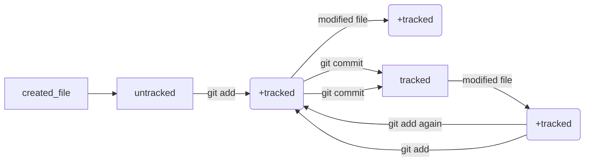

# Краткая шпаргалка по базовым командам Git.

---

1. Инициализация локального репозитория:
```
git init
```

2. Добавление изменений для отслеживания истории изменений:

2.1. Добавить один файл
```
git add some_file.txt
```
2.2. Добавление всех файлов
```
git add --all
```

3. Фиксация изменений:
```
git commit -m "Текст сообщения"
```

4. Связывание локально и удаленного репозитория:
```
git remote add origin github.com/%ИМЯ_АККАУНТА%/%ИМЯ_ПРОЕКТА% 
```

5. Проверка связанности локально и удалённого репозитория:
```
git remote -v
```

6. Отправка изменений в удалённый репозиторий:

6.1. Первый раз:
```
git push -u origin main 
```
6.2. Последующие:
```
git push
```

7. Клонировать удалённый репозиторий:
```
git clone github.com/%ИМЯ_АККАУНТА%/%ИМЯ_ПРОЕКТА%
```

8. Проверка статуса репозитория:
```
git status
```  
---

## Что такое хеш:
Основной идентификатор коммита — это его хеш.
Git хранит таблицу соответствий хеш → информация о коммите. Если вы знаете хеш, вы можете узнать всё остальное: автора и дату коммита и содержимое закоммиченных файлов. Можно сказать, что хеш — основной идентификатор коммита.
Все хеши и таблицу хеш → информация о коммите Git сохраняет в служебные файлы. Они находятся в скрытой папке .git в репозитории проекта.

## Информация о коммите(далее описание): 
Описание - это набор данных: когда был сделан коммит, содержимое файлов в репозитории на момент коммита и ссылка на предыдущий, или родительский (англ. parent), коммит. Git хеширует (преобразует) эту информацию с помощью алгоритма SHA-1 (от англ. Secure Hash Algorithm — «безопасный алгоритм хеширования») и получает для каждого коммита свой уникальный хеш — результат хеширования.
Вот из каких элементов состоит описание:
1. Строка из цифр и латинских букв после слова commit — это уже знакомый вам хеш коммита.
2. Author — имя автора и его электронная почта.
3. Date — дата и время создания коммита.
4. Сообщение к коммиту.

## Сокращённый лог:
Если в репозитории уже много коммитов — например, сотни или тысячи, — пригодится сокращённый лог. С ним можно быстро найти нужный коммит по описанию.
Сокращённый лог вызывают командой git log с флагом --oneline (англ. «одной строкой»). При этом в терминале появятся только первые несколько символов хеша каждого коммита и комментарии к ним.
Сокращённый хеш (первые несколько символов полного) можно использовать точно так же, как и полный. Для этого команда git log --oneline автоматически подбирает такую длину сокращённых хешей, чтобы они были уникальными в пределах репозитория и Git всегда мог понять, о каком коммите идёт речь.
```
git log --oneline
```
## HEAD — всему голова:
Файл HEAD (англ. «голова», «головной») — один из служебных файлов папки .git. Он указывает на коммит, который сделан последним (то есть на самый новый).

---

## Статусы untracked/tracked, staged и modified

